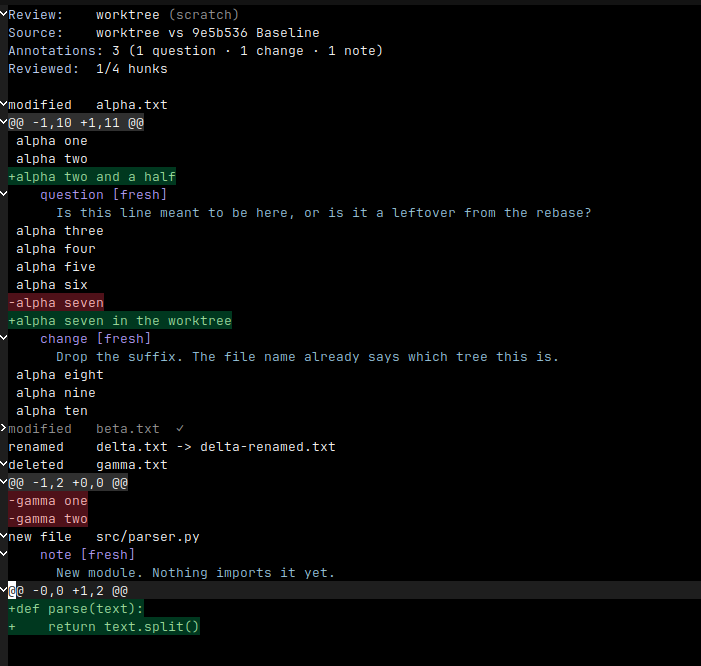

# revu

Review diffs and files in Emacs, with annotations agents can read.

revu opens a diff, or a single file, in a read-only buffer built on
`magit-section`. You annotate lines, ranges, hunks, files or the review as
a whole, and mark what you have read. Every annotation is written at once
to a JSON file under `.revu/` in the project, the **Sidecar**, so a coding
agent or a script can read the review while you are still writing it. An
agent answers a question by writing into that file; you reload and see the
reply inline. For tools that already speak [revdiff](https://github.com/umputun/revdiff)
markdown, revu exports the same review in that format.



## Status

Version 0.1.0. The author uses it daily, and the buffer, the commands and
the export are stable enough to build on. The Sidecar JSON schema may
still change before 1.0; the file carries a `schema` number, and a change
to it will be a documented one.

## Requirements

- Emacs 29.1 or later
- [magit-section](https://github.com/magit/magit) 4.3.6 or later
- [transient](https://github.com/magit/transient) 0.3.0 or later (Emacs 29
  and 30 bundle a newer one)
- git, on `PATH`

Evil and magit are optional. With evil loaded, revu binds its own keys for
evil's normal and motion states. With magit installed, the experimental
[magit bridge](#reviewing-from-magit) can route magit's diff commands into
a review.

## Installation

revu is not on ELPA or MELPA. Install it from this repository with any of
the following.

### use-package with `:vc` (Emacs 30)

```elisp
(use-package revu
  :vc (:url "https://github.com/jxonas/revu" :rev :newest)
  :commands (revu-diff-worktree revu-diff-since revu-diff-staged
             revu-diff-range revu-diff-buffer revu-file revu-open))
```

On Emacs 29, install once with `M-x package-vc-install RET
https://github.com/jxonas/revu RET` and drop the `:vc` line.

### straight.el

```elisp
(use-package revu
  :straight (revu :type git :host github :repo "jxonas/revu")
  :commands (revu-diff-worktree revu-diff-since revu-diff-staged
             revu-diff-range revu-diff-buffer revu-file revu-open))
```

### Elpaca

```elisp
(use-package revu
  :ensure (:host github :repo "jxonas/revu")
  :commands (revu-diff-worktree revu-diff-since revu-diff-staged
             revu-diff-range revu-diff-buffer revu-file revu-open))
```

### Doom Emacs

In `packages.el`:

```elisp
(package! revu :recipe (:host github :repo "jxonas/revu"))
```

In `config.el`:

```elisp
(use-package! revu
  :commands (revu-diff-worktree revu-diff-since revu-diff-staged
             revu-diff-range revu-diff-buffer revu-file revu-open))
```

Then `doom sync`. Doom's evil is picked up automatically; see
[Keys](#keys) for the evil column.

### Spacemacs

In `dotspacemacs-additional-packages`:

```elisp
(revu :location (recipe :fetcher github :repo "jxonas/revu"))
```

And in `dotspacemacs/user-config`:

```elisp
(use-package revu
  :commands (revu-diff-worktree revu-diff-since revu-diff-staged
             revu-diff-range revu-diff-buffer revu-file revu-open))
```

### Manual

Install `magit-section` and `transient` from NonGNU ELPA or MELPA, clone
this repository, and add it to `load-path`:

```elisp
(add-to-list 'load-path "/path/to/revu")
(require 'revu)
```

## Reviewing

Every command below opens a Review buffer named `*revu: <name>*`. The name
is derived from what is being reviewed, so running the same command again
resumes the same Review with its annotations and marks. A prefix argument
asks for a name instead. `revu-rename` gives a name to a Review that
turned out to be worth keeping.

| Command | Reviews |
| --- | --- |
| `revu-diff-worktree` | Everything the worktree carries that HEAD does not: staged, unstaged and untracked files. |
| `revu-diff-since` | The same, against a revision you name. "Everything since the tag." |
| `revu-diff-staged` | What is staged in the index. |
| `revu-diff-range` | What two revisions differ by, `main..feature`. |
| `revu-diff-buffer` | A unified diff already in a buffer: a patch from mail, a review page, another machine. |
| `revu-file` | One plain file, flat, with no diff about it. |
| `revu-open` | Any Review on disk, reopened over the Source it was taken over. |

`revu-diff-worktree`, `revu-diff-staged` and `revu-diff-range` also take a
list of git pathspecs when called from Lisp, to narrow a Review to part of
the tree.

### Keys

The buffer inherits everything `magit-section` gives a tree buffer: `TAB`
folds, `n` and `p` walk sections, `M-n` and `M-p` walk siblings, `^` goes
up, `1` to `4` show levels, `q` buries the buffer. revu adds:

| Key | Evil | Command |
| --- | --- | --- |
| `a` | `a` | Annotate what point is on: a selection, a line, a file heading, or the header for the whole Review |
| `e` | `e` | Edit the Annotation at point |
| `k` | `x` | Delete the Annotation at point |
| `r` | `r` | Toggle the Reviewed mark on the hunk or file at point |
| `E` | `E` | Export the Review as revdiff markdown and hand the file to an agent |
| `W` | `W` | Put the revdiff markdown on the kill ring instead |
| `g` | `gr` | Reload the Sidecar and the Source, re-anchoring every Annotation |
| `RET` | `RET` | Visit the line the Annotation or Source line at point refers to |
| `?` | `?` | The palette: every command, including the ones with no key |

Under evil, `j`/`k` and the arrows move by visual line, `gj`/`gk` and
`C-j`/`C-k` walk sections, `gh` goes up, `[` and `]` walk siblings, and
`za`/`zo`/`zc`/`zr` fold. These are bound by revu itself, so the buffer
behaves the same on bare evil, evil-collection and Doom.

The palette, `?`, is the only way to reach three commands: `revu-force-write`,
which writes over whatever an agent left in the Sidecar, and the two render
filters, hide what is reviewed and show only what is annotated. It also
lists `revu-annotate-line`, `-range`, `-hunk`, `-file` and `-review` for
targeting something other than what point is on, and starts a new Review
of any kind.

### Annotations

An Annotation has a **Kind**: a `question` to be answered, a `change` to
be made, or a `note` with no action expected. It is attached to a line, a
range of lines, a whole file, or the Review as a whole. Each line
Annotation records an **Anchor**, the line's text and three lines of
context on either side, and every render re-locates it against the file
as it is now. An Annotation is shown as `fresh` when its line is where it
was, `moved` when it was found elsewhere, and `orphaned` when it was not
found at all.

### Reviewed marks

`r` marks the hunk at point as read, collapses it and moves on to the
next. On a file heading it marks every hunk of the file. A mark is tied
to a digest of the content it was taken over, so a hunk that changes
after you marked it comes back unmarked. Marks are for you and are never
exported.

## The Sidecar and agents

Each Review is one JSON file, `.revu/reviews/<name>.json`, at the root of
the project. Every add, edit or delete writes the whole file atomically.
It is the review state itself, not a cache of it, and it is what an agent
reads:

```json
{"schema":1,"name":"worktree",
 "source":{"kind":"worktree","base":"0ab0931293208e85b2f40b9b75982a3c1c3526f5"},
 "annotations":[
  {"id":"01M25WB0WT8BGPTEPY5BX6QQ0R","kind":"question",
   "target":{"kind":"line","path":"alpha.txt","line":3,"origin":"added"},
   "anchor":{"line":"alpha two and a half",
             "before":["alpha one","alpha two"],
             "after":["alpha three","alpha four","alpha five"],
             "digest":"f14e06a4…"},
   "body":"Is this line meant to be here, or is it a leftover from the rebase?",
   "created":"2026-09-10T14:42:52Z","updated":"2026-09-10T14:42:52Z"},
  {"id":"01M25WB0X6QP6PJEF0ZA261N8G","kind":"note",
   "target":{"kind":"file","path":"src/parser.py"},
   "body":"New module. Nothing imports it yet.",
   "created":"2026-09-10T14:42:52Z","updated":"2026-09-10T14:42:52Z"}],
 "reviewed":[{"path":"beta.txt","digest":"81bf7045…","span":[1,4],
              "created":"2026-09-10T14:42:52Z"}]}
```

`revu-sidecar-path` (`p` in the palette) puts the file's path on the kill
ring together with the contract an agent writes under:

> Answer a question by setting that Annotation's reply string. Append your
> own Annotations with fresh ULIDs. Delete nothing and reorder nothing.
> Keep the JSON valid, and preserve every field you do not understand.

When the agent is done, `g` reloads. Replies appear under their questions
and the agent's own Annotations are re-anchored like yours. revu remembers
what the file looked like when it last read it and refuses to write over a
file that changed underneath it, so nothing an agent wrote is lost to a
keystroke; reload first, or use `revu-force-write` from the palette when
what it wrote is garbage.

Add `.revu/` to the project's `.gitignore`. It is personal working state,
and revu never edits `.gitignore` for you.

## Exporting as revdiff markdown

`E` writes `.revu/exports/<name>.md` in the format
[revdiff](https://github.com/umputun/revdiff) writes and its agent plugins
read, and puts the path on the kill ring with the same hand-off contract.
`W` puts the markdown itself on the kill ring for a pull request or a
chat. The Review above exports as:

```markdown
## alpha.txt:3 (+)
?? Is this line meant to be here, or is it a leftover from the rebase?

## alpha.txt:8 (+)
Drop the suffix. The file name already says which tree this is.

## src/parser.py (file-level)
New module. Nothing imports it yet.
```

The format is poorer than the Sidecar: paths and lines are written as they
are today, an Annotation on the Review as a whole has no place in it and is
left out with a message saying so, and Reviewed marks never appear.

## Reviewing from magit

`revu-magit-mode` is experimental and off by default. Turning it on loads
magit, adds a "Review in revu" switch to the `magit-diff` transient, and
advises the functions magit's diff commands go through. With the switch
on, `d d`, `d r`, `d s`, `d u`, `d w` and `d c` open a Review over what
magit was about to show. Turning the mode off takes everything back out.
It needs magit 4.4 or later.

```elisp
(revu-magit-mode 1)
```

## Customization

| Variable | Default | Meaning |
| --- | --- | --- |
| `revu-line-numbers` | `nil` | Draw each source line's number in front of it. |
| `revu-anchor-search-radius` | `500` | How many lines from its recorded position revu looks for an Annotation whose file changed. |

revu inherits your `magit-section` settings. Put any override you want
only in Reviews on `revu-mode-hook`; for example, to turn off the
current-section highlight there:

```elisp
(add-hook 'revu-mode-hook
          (lambda () (setq-local magit-section-highlight-current nil)))
```

## Design

The decisions behind the package are written down as architecture
decision records in [`docs/adr/`](docs/adr/), and the vocabulary used in
the code and in this README is in [`CONTEXT.md`](CONTEXT.md). Start with
[ADR-0002](docs/adr/0002-sidecar-file-is-the-review-state.md), the Sidecar
as the review state, and
[ADR-0003](docs/adr/0003-annotation-record-and-anchor-model.md), the
Annotation and Anchor model.

## Development

The project builds with [Eldev](https://github.com/emacs-eldev/eldev).
Three checks must be clean before a change lands:

```
eldev test -B
eldev lint
eldev compile
```

See [`CONTRIBUTING.md`](CONTRIBUTING.md). Bugs and requests go to
[GitHub Issues](https://github.com/jxonas/revu/issues).

## License

GPL-3.0-or-later. See [`COPYING`](COPYING).
